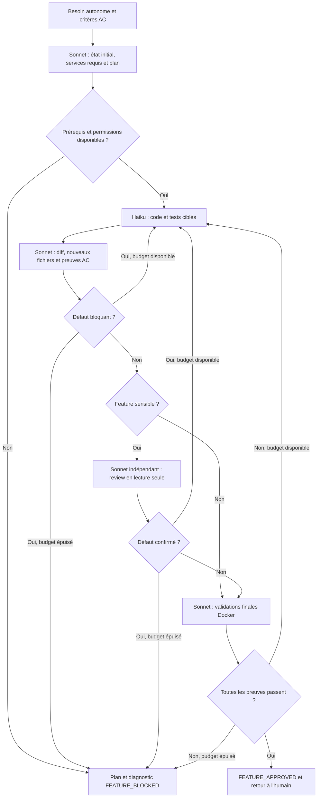

# Fonctionnement des agents Claude

La commande `/feature` lance Sonnet pour analyser, planifier et valider.
**Haiku reste imposé pour tout le code, les tests et les corrections.**
L'architecte peut créer et modifier les fichiers `.md` du projet, y compris les
règles et la documentation Markdown sous `.claude/`. La review indépendante
reste sans édition. L'humain conserve les opérations Git d'écriture.

Le processus complet a une seule source :
[.claude/feature-workflow.md](.claude/feature-workflow.md).
La configuration, les prérequis, les tests et les résultats d'audit sont décrits
dans [.claude/README.md](.claude/README.md).
Les règles NestJS/Angular sont dans [coding_standards.md](coding_standards.md).

Le budget est de trois appels Haiku par étape, avec une à trois étapes au plus
fixées dès le plan. Un hook contrôle la séquence et le plafond ; changer le plan
ou l'identifiant du coder ne réinitialise pas le compteur. Les journaux
locaux enregistrent les observations des outils ; le reviewer explique les
défauts initiaux, corrections, critères couverts et validations dans son rapport.
Les exceptions sensibles sont préparées concrètement et autorisées par
l'humain avec chemins/commandes exacts, session et expiration. Elles ne peuvent
pas autoriser Git d'écriture, secrets, règles des agents pour le coder ou anciennes
migrations. L'architecte dispose directement de l'autorisation d'édition Markdown.

`context: fork` ne transmet pas toute la discussion antérieure : donner à
`/feature` un besoin complet, ou le chemin d'une spécification avec ses critères.
Aucun service hors périmètre n'est exigé. Les échecs préexistants sont distingués
des régressions, mais un check ou test obligatoire en échec empêche l'approbation.
